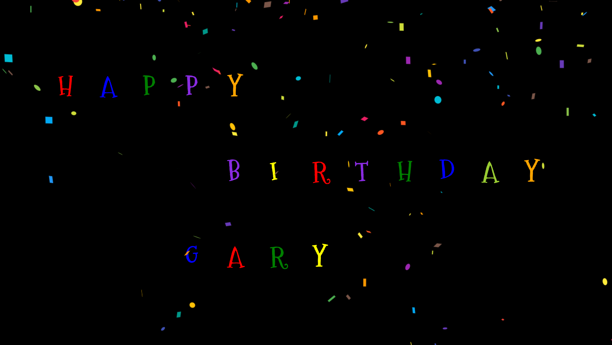

# Happy Birthday

  ## Table of Contents

  * [Description](#description)
  * [Screenshot](#screenshot)
  * [Installation Instructions](#installation-instructions)
  * [Usage](#usage)
  * [Technologies Used](#technologies-used)
  * [Tests](#tests)
  * [Credits](#credits)
  * [Contributing](#contributing)
  * [Questions](#questions)
  * [Badges](#badges)

  ## Description

  This is a simple little React-based "Happy Birthday" animation using the react-reveal library, react-bootstrap, and the react-confetti node module.

  ## Screenshot

  Happy Birthday:
  

  ## Installation Instructions

  npm install

  ## Usage

  This project is intended to be used to wish my coding instructor "happy birthday."

  ## Technologies Used

  Node.js, React, react-reveal, React-Bootstrap, react-confetti

  ## Tests

  npm run test

  ## Credits

  N/A

  ## Contributing

  N/A

  ## Questions

  If you have further questions, you can reach me at lauracole1900@comcast.net. For more of my work, see [my GitHub](https://github.com/LauraCole1900).

  ## Badges

   
